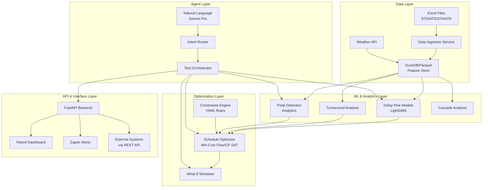

# Design Document

## Overview

The Agentic AI Flight Scheduling system is designed as a microservices architecture that combines machine learning, optimization algorithms, and natural language processing to provide intelligent flight schedule management. The system processes historical flight data to learn delay patterns, predicts risks, and optimizes schedules while providing an intuitive natural language interface for airport operations staff.

The architecture follows a layered approach with clear separation between data ingestion, analytics, optimization, and presentation layers. The system is designed to handle real-time what-if scenarios while maintaining historical context for learning and prediction.

## Architecture



## Components and Interfaces

### Data Ingestion Service
**Purpose:** Process multiple Excel files and normalize flight data
**Key Functions:**
- Parse Excel files with flexible column mapping
- Convert IST timestamps to UTC with timezone handling
- Calculate delay metrics (departure/arrival delays)
- Handle missing data with intelligent fallbacks
- Store in optimized Parquet format

**Interface:**
```python
class DataIngestionService:
    def ingest_excel_files(self, file_paths: List[str]) -> IngestResult
    def normalize_timestamps(self, df: DataFrame) -> DataFrame
    def calculate_delays(self, df: DataFrame) -> DataFrame
    def validate_data_quality(self, df: DataFrame) -> ValidationReport
```

### Analytics Engine
**Purpose:** Generate insights from historical flight data
**Key Functions:**
- Peak traffic analysis with configurable time buckets
- Demand vs capacity heatmaps
- Cascade dependency graph construction
- High-impact flight identification

**Interface:**
```python
class AnalyticsEngine:
    def analyze_peaks(self, airport: str, bucket_minutes: int) -> PeakAnalysis
    def build_cascade_graph(self, flights: List[Flight]) -> CascadeGraph
    def identify_high_impact_flights(self, graph: CascadeGraph) -> List[HighImpactFlight]
    def generate_demand_heatmap(self, airport: str, date_range: DateRange) -> Heatmap
```

### ML Prediction Models
**Purpose:** Predict delay risks and operational metrics
**Key Models:**
- Departure Delay Risk (binary classification + regression)
- Arrival Delay Risk (mirror of departure model)
- Turnaround Time Quantiles (P90 estimation)
- Taxi Time Estimation (EXOT/EXIN)

**Interface:**
```python
class DelayRiskPredictor:
    def predict_departure_delay(self, flight: Flight, context: OperationalContext) -> DelayPrediction
    def predict_arrival_delay(self, flight: Flight, context: OperationalContext) -> DelayPrediction
    def estimate_turnaround_time(self, aircraft: Aircraft, airport: str) -> TurnaroundEstimate
    def predict_taxi_time(self, flight: Flight, runway: str) -> TaxiTimeEstimate
```

### Schedule Optimizer
**Purpose:** Optimize flight schedules using constraint-based algorithms
**Key Functions:**
- Min-cost flow formulation for slot assignment
- Multi-objective optimization with configurable weights
- Constraint satisfaction for operational rules
- Real-time optimization for what-if scenarios

**Interface:**
```python
class ScheduleOptimizer:
    def optimize_schedule(self, flights: List[Flight], constraints: Constraints, 
                         weights: ObjectiveWeights) -> OptimizationResult
    def what_if_analysis(self, base_schedule: Schedule, changes: List[FlightChange]) -> ImpactAnalysis
    def validate_constraints(self, schedule: Schedule, constraints: Constraints) -> ValidationResult
```

### Natural Language Interface
**Purpose:** Process natural language queries and route to appropriate tools
**Key Functions:**
- Intent classification using Gemini Pro
- Query parameter extraction
- Tool orchestration and response formatting
- Context-aware conversation management

**Interface:**
```python
class NLInterface:
    def process_query(self, query: str, context: ConversationContext) -> Response
    def classify_intent(self, query: str) -> Intent
    def extract_parameters(self, query: str, intent: Intent) -> Parameters
    def format_response(self, tool_result: Any, intent: Intent) -> NLResponse
```

## Data Models

### Core Flight Data Model
```python
@dataclass
class Flight:
    flight_id: str
    flight_no: str
    date_local: date
    origin: str
    destination: str
    aircraft_type: str
    tail_number: Optional[str]
    std_utc: datetime
    atd_utc: Optional[datetime]
    sta_utc: datetime
    ata_utc: Optional[datetime]
    dep_delay_min: Optional[float]
    arr_delay_min: Optional[float]
    runway: Optional[str]
    stand: Optional[str]
    source_file: str
```

### Optimization Models
```python
@dataclass
class TimeSlot:
    runway: str
    timestamp: datetime
    capacity: int
    current_demand: int
    weather_regime: WeatherRegime

@dataclass
class OptimizationResult:
    original_schedule: Schedule
    optimized_schedule: Schedule
    cost_reduction: float
    delay_improvement: DelayMetrics
    affected_flights: List[FlightChange]
    constraint_violations: List[ConstraintViolation]

@dataclass
class ImpactAnalysis:
    delay_delta: float
    peak_overload_change: int
    co2_impact: float
    fairness_score: float
    affected_flights: List[str]
```

### Analytics Models
```python
@dataclass
class PeakAnalysis:
    airport: str
    time_buckets: List[TimeBucket]
    overload_windows: List[OverloadWindow]
    capacity_utilization: float
    recommendations: List[str]

@dataclass
class CascadeNode:
    flight_id: str
    centrality_score: float
    downstream_impacts: List[str]
    cascade_depth: int
```

## Error Handling

### Data Quality Issues
- **Missing timestamps:** Fall back to scheduled times, mark as imputed
- **Invalid aircraft codes:** Use generic wake category, log for review
- **Timezone ambiguity:** Apply consistent IST→UTC conversion with DST handling
- **Duplicate records:** Deduplicate based on flight_no + date + origin + destination

### Model Failures
- **Prediction errors:** Return confidence intervals, fallback to historical averages
- **Optimization infeasibility:** Relax constraints iteratively, report trade-offs
- **API timeouts:** Implement circuit breakers, cached responses for critical queries

### System Resilience
- **Database unavailability:** Use read replicas, cached aggregations
- **External API failures:** Graceful degradation with reduced functionality
- **Memory constraints:** Implement data pagination, streaming processing
- **Concurrent access:** Use optimistic locking, conflict resolution strategies

## Testing Strategy

### Unit Testing
- **Data ingestion:** Test with malformed Excel files, edge cases in timestamps
- **ML models:** Validate predictions against held-out test sets, check for bias
- **Optimization:** Test constraint satisfaction, objective function correctness
- **NL interface:** Test intent classification accuracy, parameter extraction

### Integration Testing
- **End-to-end workflows:** User query → optimization → dashboard display
- **API contracts:** Validate request/response schemas, error handling
- **Database operations:** Test concurrent reads/writes, transaction integrity
- **External integrations:** Mock weather APIs, Slack notifications

### Performance Testing
- **Load testing:** Simulate concurrent users, measure response times
- **Data volume testing:** Test with full 59-file dataset, memory usage
- **Optimization scalability:** Test with increasing flight counts, time windows
- **Real-time constraints:** Ensure what-if analysis completes within 5 seconds

### User Acceptance Testing
- **Natural language queries:** Test with domain experts, measure comprehension
- **Dashboard usability:** A/B test different visualization approaches
- **Alert effectiveness:** Measure response times to critical notifications
- **Optimization quality:** Compare against manual scheduling decisions

## Deployment Architecture

### Containerization
- **Microservices:** Each component in separate Docker containers
- **Orchestration:** Kubernetes for scaling, health checks, rolling updates
- **Configuration:** Environment-specific configs via ConfigMaps/Secrets
- **Monitoring:** Prometheus metrics, Grafana dashboards, ELK logging

### Data Pipeline
- **Batch processing:** Nightly model retraining, historical data updates
- **Stream processing:** Real-time flight status updates, alert generation
- **Data versioning:** Track model versions, data lineage for reproducibility
- **Backup strategy:** Automated backups, point-in-time recovery

### Security Considerations
- **API authentication:** JWT tokens, rate limiting, input validation
- **Data encryption:** At-rest and in-transit encryption for sensitive data
- **Access control:** Role-based permissions for different user types
- **Audit logging:** Track all optimization decisions, data access patterns