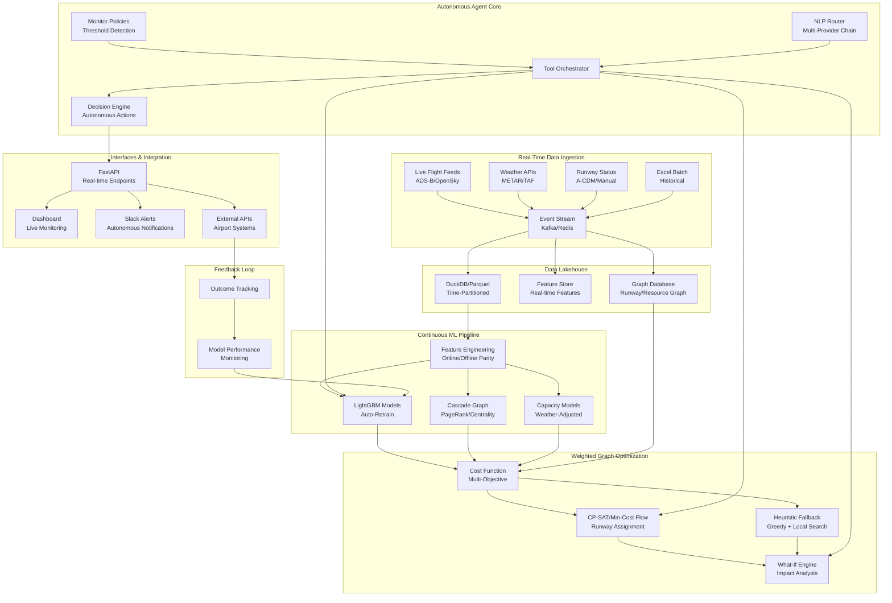

# Design Document

## Overview

The Agentic AI Flight Scheduling system is an autonomous intelligent agent that provides continuous real-time flight schedule optimization and delay prevention. The system combines advanced machine learning, weighted graph optimization, and natural language processing to operate as a 24/7 autonomous co-pilot for airport operations.

The architecture follows an event-driven, autonomous agent pattern with real-time data ingestion, continuous learning, and proactive decision-making capabilities. The system monitors live flight data, weather conditions, and runway availability to automatically detect issues, optimize schedules, and prevent delay cascades before they occur. It operates with minimal human intervention while providing transparent explanations of its autonomous decisions.

## Architecture



## Components and Interfaces

### Real-Time Data Ingestion Service
**Purpose:** Continuously ingest and process live flight data, weather, and operational updates
**Key Functions:**
- Stream live flight data from ADS-B/OpenSky APIs
- Integrate real-time weather data (METAR/TAF)
- Process runway availability and A-CDM updates
- Maintain online/offline feature parity
- Handle data quality and missing values in real-time
- Store in time-partitioned format for fast queries

**Interface:**
```python
class RealTimeIngestionService:
    def start_live_streams(self) -> None
    def process_flight_update(self, flight_data: FlightUpdate) -> None
    def process_weather_update(self, weather_data: WeatherUpdate) -> None
    def process_runway_update(self, runway_data: RunwayStatus) -> None
    def get_live_features(self, flight_id: str) -> FeatureVector
    def ingest_excel_batch(self, file_paths: List[str]) -> IngestResult
```

### Analytics Engine
**Purpose:** Generate insights from historical flight data
**Key Functions:**
- Peak traffic analysis with configurable time buckets
- Demand vs capacity heatmaps
- Cascade dependency graph construction
- High-impact flight identification

**Interface:**
```python
class AnalyticsEngine:
    def analyze_peaks(self, airport: str, bucket_minutes: int) -> PeakAnalysis
    def build_cascade_graph(self, flights: List[Flight]) -> CascadeGraph
    def identify_high_impact_flights(self, graph: CascadeGraph) -> List[HighImpactFlight]
    def generate_demand_heatmap(self, airport: str, date_range: DateRange) -> Heatmap
```

### ML Prediction Models
**Purpose:** Predict delay risks and operational metrics
**Key Models:**
- Departure Delay Risk (binary classification + regression)
- Arrival Delay Risk (mirror of departure model)
- Turnaround Time Quantiles (P90 estimation)
- Taxi Time Estimation (EXOT/EXIN)

**Interface:**
```python
class DelayRiskPredictor:
    def predict_departure_delay(self, flight: Flight, context: OperationalContext) -> DelayPrediction
    def predict_arrival_delay(self, flight: Flight, context: OperationalContext) -> DelayPrediction
    def estimate_turnaround_time(self, aircraft: Aircraft, airport: str) -> TurnaroundEstimate
    def predict_taxi_time(self, flight: Flight, runway: str) -> TaxiTimeEstimate
```

### Weighted Graph Schedule Optimizer
**Purpose:** Optimize flight schedules using weighted graph algorithms and constraint satisfaction
**Key Functions:**
- Bipartite graph modeling (flights ↔ runway-time slots)
- Multi-objective cost function with runway-dependent weights
- CP-SAT and min-cost flow solvers with heuristic fallbacks
- Real-time constraint validation and feasibility checking
- Autonomous optimization triggers based on operational thresholds

**Interface:**
```python
class WeightedGraphOptimizer:
    def build_feasibility_graph(self, flights: List[Flight], slots: List[TimeSlot]) -> BipartiteGraph
    def calculate_edge_costs(self, flight: Flight, slot: TimeSlot, weights: ObjectiveWeights) -> float
    def solve_assignment(self, graph: BipartiteGraph, solver: str = "cp_sat") -> OptimizationResult
    def autonomous_optimize(self, trigger_conditions: Dict[str, Any]) -> OptimizationResult
    def what_if_analysis(self, base_schedule: Schedule, changes: List[FlightChange]) -> ImpactAnalysis
    def validate_runway_constraints(self, assignment: Dict[str, str]) -> List[ConstraintViolation]
```

### Autonomous Agent Core
**Purpose:** Provide autonomous decision-making and multi-provider NLP capabilities
**Key Functions:**
- Multi-provider NLP chain (Gemini Pro → Perplexity → OpenAI → Local)
- Autonomous monitoring with policy-based triggers
- Tool orchestration and decision engine
- Confidence-based autonomous actions
- Transparent reasoning and explanation generation

**Interface:**
```python
class AutonomousAgent:
    def process_query(self, query: str, context: ConversationContext) -> Response
    def monitor_conditions(self, policies: List[MonitorPolicy]) -> List[TriggerEvent]
    def execute_autonomous_action(self, trigger: TriggerEvent, confidence_threshold: float) -> ActionResult
    def explain_decision(self, action: ActionResult) -> Explanation
    def classify_intent_with_fallback(self, query: str) -> Intent
    def orchestrate_tools(self, intent: Intent, parameters: Dict[str, Any]) -> ToolResult
```

### Continuous Learning ML Pipeline
**Purpose:** Provide adaptive machine learning with real-time model updates
**Key Functions:**
- Incremental learning with online feature engineering
- Automated model retraining based on performance drift
- Ensemble methods combining multiple prediction approaches
- Real-time feature store for low-latency inference
- Model performance monitoring and alerting

**Interface:**
```python
class ContinuousLearningPipeline:
    def update_features_online(self, flight_update: FlightUpdate) -> None
    def retrain_models_incremental(self, new_data: DataFrame) -> ModelUpdateResult
    def predict_with_ensemble(self, features: FeatureVector) -> EnsemblePrediction
    def monitor_model_drift(self, predictions: List[Prediction], actuals: List[float]) -> DriftReport
    def trigger_retraining(self, drift_threshold: float) -> bool
```

### Weather Integration Service
**Purpose:** Integrate weather data and forecasts into capacity and optimization models
**Key Functions:**
- Real-time weather data ingestion and processing
- Weather-based capacity adjustment algorithms
- Predictive weather impact modeling
- Contingency planning for weather scenarios
- Integration with runway graph optimization

**Interface:**
```python
class WeatherIntegrationService:
    def process_weather_update(self, weather_data: WeatherData) -> None
    def adjust_runway_capacity(self, runway: str, weather: WeatherConditions) -> CapacityAdjustment
    def predict_weather_impact(self, forecast: WeatherForecast, horizon_hours: int) -> ImpactForecast
    def generate_weather_scenarios(self, base_schedule: Schedule) -> List[WeatherScenario]
    def optimize_for_weather(self, scenario: WeatherScenario) -> OptimizationResult
```

### Autonomous Monitor Service
**Purpose:** Continuously monitor operational conditions and trigger autonomous actions
**Key Functions:**
- Policy-based condition monitoring
- Threshold detection and alert generation
- Autonomous decision-making within predefined limits
- Escalation to human operators for complex scenarios
- Audit trail for all autonomous actions

**Interface:**
```python
class AutonomousMonitor:
    def evaluate_policies(self, policies: List[MonitorPolicy]) -> List[PolicyTrigger]
    def execute_autonomous_action(self, trigger: PolicyTrigger) -> ActionResult
    def escalate_to_human(self, complex_scenario: Scenario) -> EscalationRequest
    def log_autonomous_decision(self, action: ActionResult, reasoning: str) -> None
    def check_guardrails(self, proposed_action: Action) -> GuardrailCheck
```

## Data Models

### Core Flight Data Model
```python
@dataclass
class Flight:
    flight_id: str
    flight_no: str
    date_local: date
    origin: str
    destination: str
    aircraft_type: str
    tail_number: Optional[str]
    std_utc: datetime
    atd_utc: Optional[datetime]
    sta_utc: datetime
    ata_utc: Optional[datetime]
    dep_delay_min: Optional[float]
    arr_delay_min: Optional[float]
    runway: Optional[str]
    stand: Optional[str]
    source_file: str
```

### Optimization Models
```python
@dataclass
class TimeSlot:
    runway: str
    timestamp: datetime
    capacity: int
    current_demand: int
    weather_regime: WeatherRegime

@dataclass
class OptimizationResult:
    original_schedule: Schedule
    optimized_schedule: Schedule
    cost_reduction: float
    delay_improvement: DelayMetrics
    affected_flights: List[FlightChange]
    constraint_violations: List[ConstraintViolation]

@dataclass
class ImpactAnalysis:
    delay_delta: float
    peak_overload_change: int
    co2_impact: float
    fairness_score: float
    affected_flights: List[str]
```

### Analytics Models
```python
@dataclass
class PeakAnalysis:
    airport: str
    time_buckets: List[TimeBucket]
    overload_windows: List[OverloadWindow]
    capacity_utilization: float
    recommendations: List[str]

@dataclass
class CascadeNode:
    flight_id: str
    centrality_score: float
    downstream_impacts: List[str]
    cascade_depth: int
```

### Weighted Graph Models
```python
@dataclass
class BipartiteGraph:
    flight_nodes: List[FlightNode]
    slot_nodes: List[SlotNode]
    edges: List[WeightedEdge]
    constraints: List[GraphConstraint]

@dataclass
class WeightedEdge:
    flight_id: str
    slot_id: str
    cost: float
    cost_breakdown: Dict[str, float]  # delay, taxi, fairness, environment, curfew
    feasible: bool
    constraint_violations: List[str]

@dataclass
class SlotNode:
    slot_id: str
    runway: str
    timestamp: datetime
    capacity: int
    current_demand: int
    weather_adjusted_capacity: int
    is_curfew: bool
    
@dataclass
class FlightNode:
    flight_id: str
    original_slot: datetime
    constraints: List[str]  # turnaround, wake, curfew
    priority_score: float
    airline: str
```

### Real-Time Data Models
```python
@dataclass
class FlightUpdate:
    flight_id: str
    update_type: str  # "status", "gate", "runway", "delay"
    timestamp: datetime
    old_value: Any
    new_value: Any
    source: str  # "ads-b", "a-cdm", "manual"

@dataclass
class WeatherUpdate:
    airport_code: str
    timestamp: datetime
    visibility_km: float
    wind_speed_kts: float
    wind_direction: int
    precipitation: bool
    weather_regime: WeatherRegime
    forecast_horizon_hours: int

@dataclass
class RunwayStatus:
    runway_id: str
    airport_code: str
    status: str  # "open", "closed", "maintenance"
    capacity_override: Optional[int]
    closure_reason: Optional[str]
    estimated_reopening: Optional[datetime]

@dataclass
class AutonomousAction:
    action_id: str
    trigger_condition: str
    action_type: str  # "optimize", "alert", "adjust_capacity"
    confidence_score: float
    affected_flights: List[str]
    expected_impact: Dict[str, float]
    human_approval_required: bool
    reasoning: str
    timestamp: datetime
```

### Monitoring and Policy Models
```python
@dataclass
class MonitorPolicy:
    policy_id: str
    name: str
    condition: str  # "utilization > 1.10", "delayed_30m_count >= 5"
    action: str    # "optimize_top_risk", "alert_slack"
    threshold_values: Dict[str, float]
    cooldown_minutes: int
    enabled: bool

@dataclass
class PolicyTrigger:
    policy_id: str
    trigger_time: datetime
    condition_values: Dict[str, float]
    severity: str  # "low", "medium", "high", "critical"
    recommended_action: str
    confidence: float

@dataclass
class GuardrailCheck:
    action_allowed: bool
    violations: List[str]
    max_changes_exceeded: bool
    min_notice_violated: bool
    fairness_constraints_ok: bool
    alternative_suggestions: List[str]
```

## Error Handling

### Real-Time Data Issues
- **Missing live data:** Fall back to historical patterns with confidence degradation
- **Data stream interruptions:** Buffer recent data, use exponential backoff for reconnection
- **Weather API failures:** Use cached forecasts, degrade to historical weather patterns
- **Conflicting data sources:** Implement data source priority and conflict resolution
- **Late-arriving updates:** Handle out-of-order events with timestamp-based reconciliation

### Autonomous System Failures
- **Model prediction failures:** Multi-model ensemble with fallback to rule-based systems
- **Optimization solver failures:** Automatic fallback from CP-SAT → Min-Cost Flow → Heuristic
- **Policy trigger failures:** Log errors, escalate to human operators, disable faulty policies
- **Autonomous action errors:** Rollback mechanisms, human override capabilities
- **Confidence threshold violations:** Escalate decisions to human approval

### Multi-Provider NLP Resilience
- **Gemini Pro rate limits:** Automatic fallback to Perplexity API
- **Perplexity failures:** Cascade to OpenAI with adjusted prompts
- **OpenAI unavailability:** Use local regex/rule-based intent classification
- **All NLP providers down:** Provide structured menu-based interface

### Graph Optimization Resilience
- **Infeasible graph problems:** Iterative constraint relaxation with priority ordering
- **Memory constraints for large graphs:** Graph partitioning and distributed solving
- **Solver timeout:** Return best partial solution with quality indicators
- **Constraint conflicts:** Automatic constraint prioritization and soft constraint handling

### Continuous Learning Robustness
- **Model drift detection:** Automatic retraining triggers with performance monitoring
- **Training data quality issues:** Data validation pipelines with anomaly detection
- **Feature engineering failures:** Fallback to basic feature sets with reduced accuracy
- **Model deployment failures:** Blue-green deployment with automatic rollback

## Testing Strategy

### Unit Testing
- **Data ingestion:** Test with malformed Excel files, edge cases in timestamps
- **ML models:** Validate predictions against held-out test sets, check for bias
- **Optimization:** Test constraint satisfaction, objective function correctness
- **NL interface:** Test intent classification accuracy, parameter extraction

### Integration Testing
- **End-to-end workflows:** User query → optimization → dashboard display
- **API contracts:** Validate request/response schemas, error handling
- **Database operations:** Test concurrent reads/writes, transaction integrity
- **External integrations:** Mock weather APIs, Slack notifications

### Performance Testing
- **Load testing:** Simulate concurrent users, measure response times
- **Data volume testing:** Test with full 59-file dataset, memory usage
- **Optimization scalability:** Test with increasing flight counts, time windows
- **Real-time constraints:** Ensure what-if analysis completes within 5 seconds

### User Acceptance Testing
- **Natural language queries:** Test with domain experts, measure comprehension
- **Dashboard usability:** A/B test different visualization approaches
- **Alert effectiveness:** Measure response times to critical notifications
- **Optimization quality:** Compare against manual scheduling decisions

## Deployment Architecture

### Containerization
- **Microservices:** Each component in separate Docker containers
- **Orchestration:** Kubernetes for scaling, health checks, rolling updates
- **Configuration:** Environment-specific configs via ConfigMaps/Secrets
- **Monitoring:** Prometheus metrics, Grafana dashboards, ELK logging

### Data Pipeline
- **Batch processing:** Nightly model retraining, historical data updates
- **Stream processing:** Real-time flight status updates, alert generation
- **Data versioning:** Track model versions, data lineage for reproducibility
- **Backup strategy:** Automated backups, point-in-time recovery

### Security Considerations
- **API authentication:** JWT tokens, rate limiting, input validation
- **Data encryption:** At-rest and in-transit encryption for sensitive data
- **Access control:** Role-based permissions for different user types
- **Audit logging:** Track all optimization decisions, data access patterns